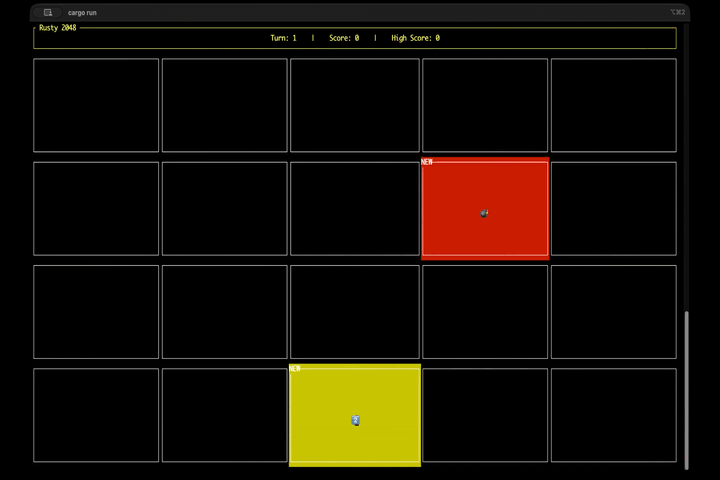
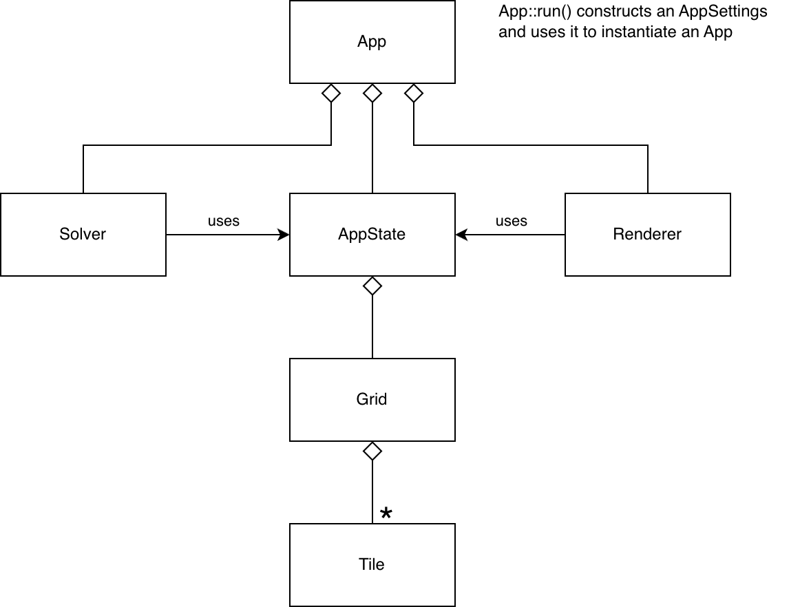

# Rusty 2048

This is my version of the [2048 Game](https://play2048.co/), built in Rust using the [Ratatui](https://ratatui.rs/) library.

My game expands on the original 2048 game with many exciting new features, such as customizable large grid size, increased difficulty with endlessly spawning more than 1 new tiles each turn, enhanced gameplay with non-numeric tiles, ability to undo up to last 3 turns, loading from auto-save, and even an auto-play mode!

Since this game is a [TUI](https://en.wikipedia.org/wiki/Text-based_user_interface) app, it has graphical limitations tied to the terminal emulator settings. Currently, there is no animation at all.



## Quick Explanation of Game

You slide tiles to move and merge any 2 adjacent tiles with same numbers into a tile with a bigger number. To win, your goal is to make a tile with the number `2048`. You lose when the grid is full, and you can no longer affect the tiles in any way.

## How to Run

```
Run the game directly with optional command line flags.
rusty_2048 [ <flag> ... ]

Run the game from cargo with optional command line flags.
cargo run -- [ <flag> ... ]

Command line flags:
  --help                            Show this usage page.
  --load                            Load the game from auto-save.
  --grid=<num_rows>,<num_cols>      Start the game with a specific grid size.
  --tty=<tty_path>                  Enable logging to a specific tty.
```

### Examples

You can run the game with no arguments. This starts a new game with the default grid size.

```
cargo run
```

You can run the game with your own grid size.

```
cargo run -- --grid=8,8
```

The game auto-saves on exit. You can run the game to continue from where you had left last time.

```
cargo run -- --load
```

## Gameplay Controls

```
  [ Q ]                             Close the app.
  [ R ]                             Start a new game.
  [ G ]                             Toggle grid visibility on/off.
  [ Z ]                             Toggle auto-play on/off.
  [ WASD ] or [ ARROW KEYS ]        Move all tiles toward a direction.
  [ BACKSPACE ]                     Undo last move (up to 3 turns ago).
```

### Quick Tips

- After opening the game, resize your terminal window until all tiles look the same size, and then press `G` to play with the grid off.

## Developer Notes

### Entity Relation Diagram



### How to Run App with Logging to Another TTY

This is a convenience feature for the developer to see logging on Terminal 2, while the app is displayed on Terminal 1.

1. In Terminal 2 (for logging), use the `tty` command to find the TTY path for this terminal.

2. In Terminal 1 (for displaying this app), run the app with logging routed to the TTY path of Terminal 2.

```
RUST_LOG=info cargo run -- --tty=/dev/ttys000
```

### How to Create Documentation

```
cargo doc --document-private-items --open
```
